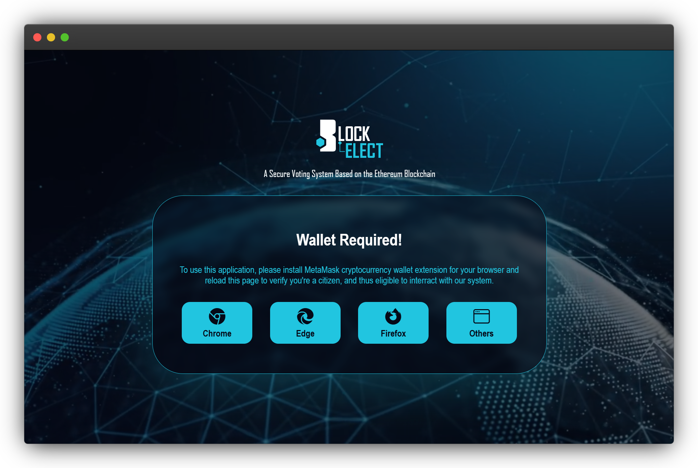
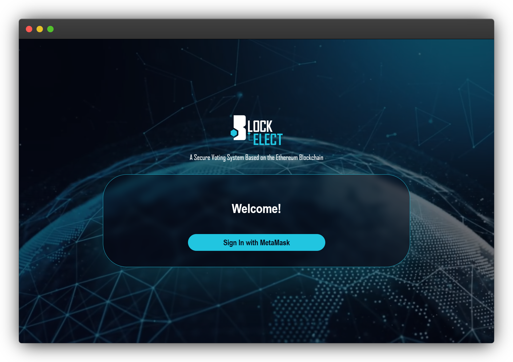
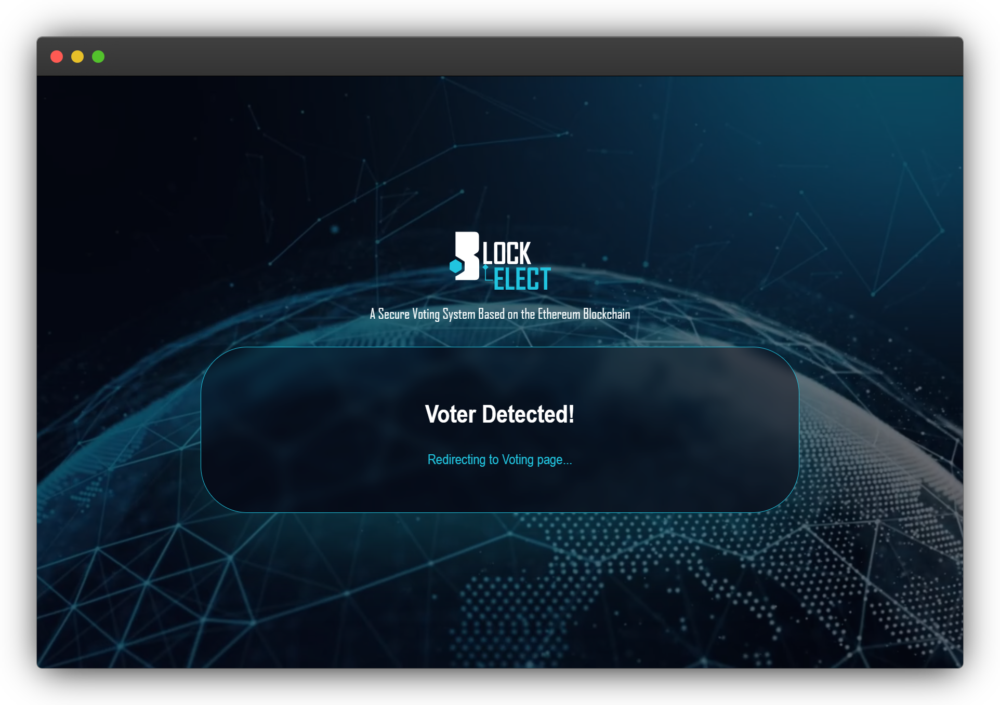
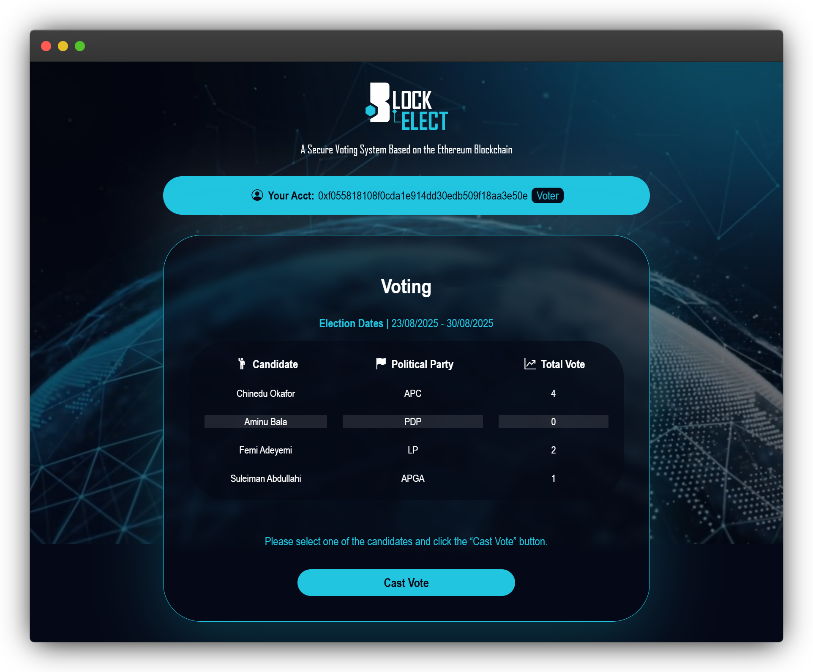
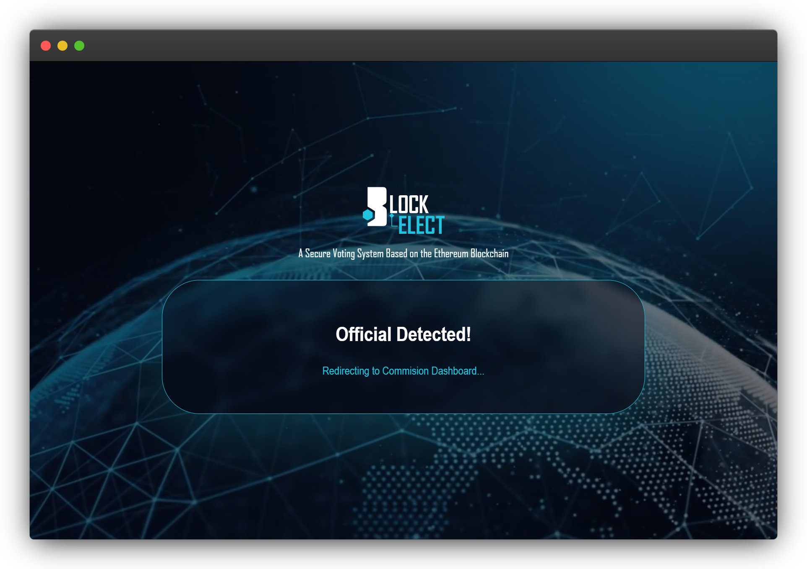
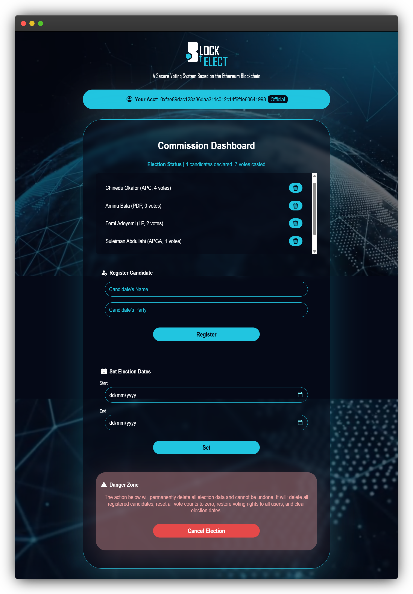

# BLOCKELECT: Blockchain-Based Secure Voting System

## 💡 Abstract

*Traditional electoral systems exhibit critical vulnerabilities including vote manipulation, centralized points of failure, and compromised transparency that undermine democratic integrity. This research presents a decentralised blockchain-based secure voting system designed to address these challenges. The system employs Ethereum smart contracts written in Solidity to enforce immutable voting rules, Web3.js for blockchain integration, and MetaMask wallet authentication for secure voter verification. The architecture implements dual interfaces for voters and electoral commissions, with distributed consensus mechanisms ensuring real-time transaction validation. Smart contracts automatically enforce electoral rules while maintaining cryptographic immutability of voting transactions. The decentralised design eliminates single points of failure by distributing vote storage and validation across multiple nodes. System validation included unit, integration, system, and security testing. Results show prevention of vote tampering, elimination of double voting, and transparent, auditable election results. Implementation used Truffle framework, Ganache blockchain simulation, and Node.js back-end services following an Agile Prototype-based Iterative Development methodology. This work demonstrates blockchain’s feasibility in creating trustworthy electoral systems, offering a viable solution to electoral fraud and public confidence issues.*

> This software was developed as part of a final year project work at the Department of Computer Science, Olusegun Agagu University of Science and Technology, Ondo State, titled 'Development of a Secure E-voting System using Blockchain Technology' by Ughili Samuel Adiwu. The paper would be available here after it has been defended.

## ⚙️ Features

- Uses Web3 wallet authentication for secure, decentralised user address verification.
- Employs Ethereum smart contracts to immutably record and secure votes on-chain.
- Removes centralised databases by using blockchain’s tamper-proof distributed ledger.
- Offers a permissioned commission dashboard with role-based management controls and real-time election monitoring.
- Provides a clean UI for seamless voting, transparent candidate information, and live blockchain feedback.

## 🛠️ Requirements

The following software versions are recommended for deploying this application (other versions might work).

- Node.js `v22.14.0`
- Web3.js `v1.10.0`
- Express.js `v4.17.14`
- Solidity `v0.8.19` (solc-js)
- Truffle `v5.11.5` (core: 5.11.5)
- Ganache GUI `v2.7.1` (or Ganache CLI `v7.9.1`)
- MetaMask `v13.1.0`
- ESBuild `v0.25.9` (or Browserify + Babelify or any ES6 bundler)

## 📱 Screenshots

 
 
 
 
 
 

## 📥 Set Up

### Prerequisites
1. **Node.js** (v22.14.0 or higher) - [Download here](https://nodejs.org/)
2. **MetaMask** browser extension - [Install here](https://metamask.io/)
3. **Git** (optional, only needed if cloning repository)
4. **Ganache** for local blockchain simulation (automatically installed via npm)

### 🚀 Quick Setup (Recommended)

**Option 1: Download ZIP (Most Common)**
1. Go to the [GitHub repository](https://github.com/elijahola831/BLOCKELECT-Blockchain-Based-Secure-Voting-System)
2. Click the green **"Code"** button → **"Download ZIP"**
3. Extract the ZIP file to your desired location
4. Open terminal/command prompt in the extracted folder
5. Run these commands:
```bash
# Install dependencies
npm install

# Run automated setup (starts Ganache, compiles & deploys contracts, bundles frontend)
npm run setup

# Start the web server
npm start
```

**Option 2: Git Clone (For Developers)**
```bash
# Clone and navigate to the repository
git clone https://github.com/elijahola831/BLOCKELECT-Blockchain-Based-Secure-Voting-System.git
cd BLOCKELECT-Blockchain-Based-Secure-Voting-System

# Install dependencies
npm install

# Run automated setup
npm run setup

# Start the web server
npm start
```

### 📋 Manual Setup (Step by Step)

If you prefer to run each step manually:

1. **Download the project:**
   - **Option A (ZIP):** Download ZIP from GitHub, extract to your desired location
   - **Option B (Git):** `git clone https://github.com/elijahola831/BLOCKELECT-Blockchain-Based-Secure-Voting-System.git`
   - Navigate to the project folder using terminal/command prompt

2. **Install dependencies:**
   ```bash
   npm install
   ```

3. **Start Ganache (Local Blockchain):**
   ```bash
   # Using npm script (recommended)
   npm run ganache
   
   # Wait for "Listening on 127.0.0.1:7545" message
   ```

4. **In a new terminal, compile Smart Contracts:**
   ```bash
   npm run compile
   ```

5. **Deploy Contracts to Local Network:**
   ```bash
   npm run migrate
   ```

6. **Bundle Frontend Assets:**
   ```bash
   npm run bundle
   ```

7. **Start the Application Server:**
   ```bash
   npm start
   # Server will run at http://localhost:3000
   # Also accessible from other devices on your network
   ```

### 🔗 MetaMask Configuration

**Step 1: Install MetaMask**
- Install the MetaMask browser extension from [metamask.io](https://metamask.io)

**Step 2: Add Ganache Local Network**
1. Open MetaMask → Click network dropdown → "Add Network" or "Custom RPC"
2. Enter these **exact** values:
   - **Network Name:** `Ganache Local`
   - **New RPC URL:** `http://127.0.0.1:7545`
   - **Chain ID:** `1337`
   - **Currency Symbol:** `ETH`
   - **Block Explorer URL:** (leave empty)
3. Click "Save"

**Step 3: Import Test Account**
1. In MetaMask: Account menu → "Import Account"
2. Select "Private Key"
3. Enter this test private key:
   ```
   0x4f3edf983ac636a65a842ce7c78d9aa706d3b113bce9c46f30d7d21715b23b1d
   ```
4. Click "Import" - you should see ~100 ETH balance

**Step 4: Switch to Ganache Network**
1. Click network dropdown in MetaMask
2. Select "Ganache Local"
3. Verify you're connected to the imported account

## 🔧 Troubleshooting

### Common Issues and Solutions

**1. "Failed to authenticate to MetaMask" Error**
- **Cause:** MetaMask not connected to the correct network or account
- **Solution:**
  ```bash
  # 1. Ensure Ganache is running
  npm run ganache
  
  # 2. Check MetaMask network settings match exactly:
  #    - Network: Ganache Local
  #    - RPC URL: http://127.0.0.1:7545
  #    - Chain ID: 1337
  
  # 3. Reset MetaMask connection:
  #    MetaMask → Settings → Advanced → Reset Account
  ```

**2. "Out of Gas" or "Invalid ABI" Error**
- **Cause:** Smart contracts not deployed or deployed to wrong network
- **Solution:**
  ```bash
  # 1. Restart Ganache (this creates a fresh blockchain)
  # Stop existing Ganache and run:
  npm run ganache
  
  # 2. In new terminal, redeploy contracts:
  npm run migrate
  
  # 3. Restart the web server:
  npm start
  ```

**3. Port Already in Use**
- **Cause:** Previous Ganache instance still running
- **Solution (Windows):**
  ```powershell
  # Find and kill processes using ports 7545 or 3000
  netstat -ano | findstr ":7545\|:3000"
  taskkill /PID <process_id> /F
  ```
- **Solution (Mac/Linux):**
  ```bash
  # Kill processes using the ports
  lsof -ti:7545 | xargs kill -9
  lsof -ti:3000 | xargs kill -9
  ```

**4. "Cannot find module" Errors**
- **Cause:** Dependencies not installed properly
- **Solution:**
  ```bash
  # Clean install dependencies
  rm -rf node_modules package-lock.json
  npm install
  ```

**5. MetaMask "Nonce too high" Error**
- **Cause:** MetaMask nonce mismatch with fresh Ganache blockchain
- **Solution:**
  1. MetaMask → Settings → Advanced → Reset Account
  2. This clears transaction history and resets nonce

**6. "ECONNREFUSED" Connection Error**
- **Cause:** Ganache not running or wrong port configuration
- **Solution:**
  ```bash
  # 1. Verify Ganache is running:
  npm run ganache
  
  # 2. Check if port 7545 is accessible:
  # Windows: telnet 127.0.0.1 7545
  # Mac/Linux: nc -zv 127.0.0.1 7545
  
  # 3. Verify truffle-config.js has correct port (7545)
  ```

### Quick Reset (Nuclear Option)
If all else fails, complete reset:
```bash
# 1. Stop all processes
# 2. Clear everything and restart
rm -rf node_modules build dist/app.bundle.js
npm install
npm run setup
npm start
```

### Getting Help
- Check the browser console for detailed error messages
- Verify MetaMask is unlocked and connected to correct network
- Ensure you have sufficient ETH in your MetaMask account (should be ~100 ETH with test account)
- Try the automated setup script: `npm run setup`

## 🚀 Deployment

### Development Mode
```bash
# Start with auto-restart on file changes
npm run dev
```

### Testing
```bash
# Ensure Ganache is running first
npm test
```

### Production Deployment

1. **Build the project:**
   ```bash
   npm run build
   ```

2. **Deploy to Ethereum Testnet/Mainnet:**
   - Update `truffle-config.js` with your network configuration
   - Add your private key and Infura/Alchemy endpoint
   - Run migrations:
     ```bash
     truffle migrate --network <network_name>
     ```

3. **Deploy the web server:**
   - The application can be deployed to any Node.js hosting platform
   - Ensure all environment variables are properly configured
   - Update contract addresses in the frontend if deployed to different networks

### Usage Instructions

**For Voters:**
1. Visit http://localhost:3000
2. Connect MetaMask wallet
3. Select a candidate from the list
4. Cast your vote (requires gas fee)

**For Electoral Officials:**
1. Visit http://localhost:3000/official.html
2. Connect MetaMask wallet (must be the contract deployer)
3. Register candidates
4. Set election start/end dates
5. Monitor election progress
6. Reset election if needed

## 📂 Structure

The project directory is organised as follows:

```
BLOCKELECT (Prototype)              # Project root directory
|
├── build/                          # Contract build artifacts
│   └── contracts/
│       └── VotingSys.json
├── contracts/                      # Solidity smart contracts
│   └── VotingSys.sol
├── dist/                           # Bundled/compiled frontend files for deployment
│   └── app.bundle.js
├── migrations/                     # Truffle migration scripts
│   └── 1_deploy_contracts.js
├── node_modules/                   # NPM dependencies
├── src/                            # Application source files
│   ├── assets/                     # Media assets
│   │   ├── blockchain.mp4
│   │   ├── favicon.svg
│   │   └── logo.svg
│   ├── css/                        # UI stylesheets
│   │   ├── alert.css
│   │   ├── index.css
│   │   └── official.css
│   ├── icons/                      # Bootstrap icon set
│   │   ├── fonts/
│   │   └── bootstrap-icons.css
│   ├── js/                         # JavaScript logic files
│   │   ├── alert.js
│   │   └── app.js
│   ├── sounds/                     # Sound effects
│   │   ├── error.wav
│   │   ├── info.wav
│   │   ├── success.wav
│   │   └── warning.wav
│   ├── index.html                  # Voter-facing interface
│   └── official.html               # Official (admin) interface
├── views/                          # UI screenshots for documentation
│   ├── commission_dashboard.png
│   ├── official_detected.png
│   ├── sign_in.png
│   ├── voter_detected.png
│   ├── voting.png
│   └── wallet_required.png
├── LICENSE                         # Project license file
├── package-lock.json               # Locked versions of Node.js dependencies
├── package.json                    # Project metadata & Node.js package configuration
├── README.md                       # Project documentation
├── server.js                       # Backend server (Node.js application entry-point)
└── truffle-config.js               # Truffle configuration file
```

## ⚖️ License

This project is licensed under the MIT License―you are free to use, modify, and distribute of it, with attribution, but without warranty. To see a full breakdown of this license, click [here](./LICENSE).

**Attribution**

All the sound effects included in this project are from Microsoft Windows, which are the property of Microsoft Corporation. These sounds are used for demonstration purposes only and remain subject to Microsoft’s copyright and licensing terms.

---

Give this repository a ⭐ if you like it.